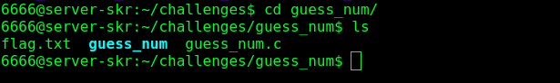
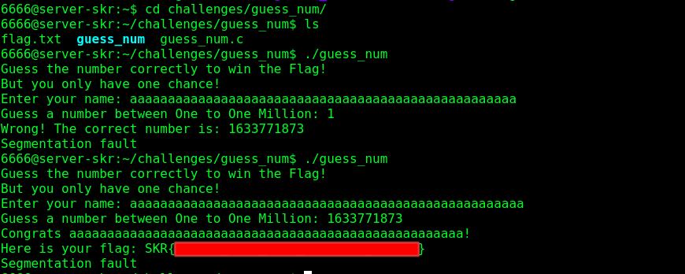

# Guess The Number (Binary)

## Source code
- [guess_num.c](guess_num.c)

Login into webshell, you can see the source code and the ELF executable:



Source code:
```c
#include <stdio.h>
#include <stdlib.h> 

#define FLAGSIZE_MAX 128

char flag[FLAGSIZE_MAX];

void setup(){ 
    FILE *f = fopen("flag.txt","r");
    fgets(flag,FLAGSIZE_MAX,f);
    gid_t gid = getegid();
    setresgid(gid, gid, gid);
} 

int main () { 
    setup();
    // Generate random number using current time
    srand(time(0)); 
    int num = (rand() % 999999) + 1;
    char name[20];
    int guess;
    printf("Guess the number correctly to win the Flag!\nBut you only have one chance!\n"); 
    printf("Enter your name: ");
    scanf("%s",&name);
    printf("Guess a number between One to One Million: ");
    scanf("%i",&guess); 
    // If you guess the correct number, you will get the flag!
    if(guess == num){ 
        printf("Congrats %s!\nHere is your flag: %s\n",name,flag);
    } 
    else{ 
        printf("Wrong! The correct number is: %i\n",num); 
    } 
    return(0);
}
```

As you can see, this challenge is about "guessing" the correct number in order to get the flag

I actually make a trap here haha, usually people think of buffer overflow always gonna using the `gets` function, actually **`scanf("%s")` is also vulnerable**

Only difference is `scanf` will stop when see white space, `gets` will stop when see newline or EOF

Remember I saw this in a CTF competition, first time I also dun know this will cause buffer overflow

Actually there are many function will cause buffer overflow if you not use properly

## Intended Solution
The intended solution actually is to **overflow the variable `num` and then the number is not longer random**

To solve this is quite easy, just a very long name, simply type an answer then copy the correct answer, overflow again paste the correct answer:



## Unintended Solution
The another solution is just guess the number by using the same timestamp of the binary

- [H0j3n's writeup](https://github.com/H0j3n/EzpzCTF/tree/main/Writeup/SKRCTF/Binary_Exploitation/Guess_The_Number)
- [lemonpooh's writeup](https://github.com/lemonpooh/SKR-CTF-WriteU-P/blob/main/Binary%20exploitation.md#1-guess-the-number)
