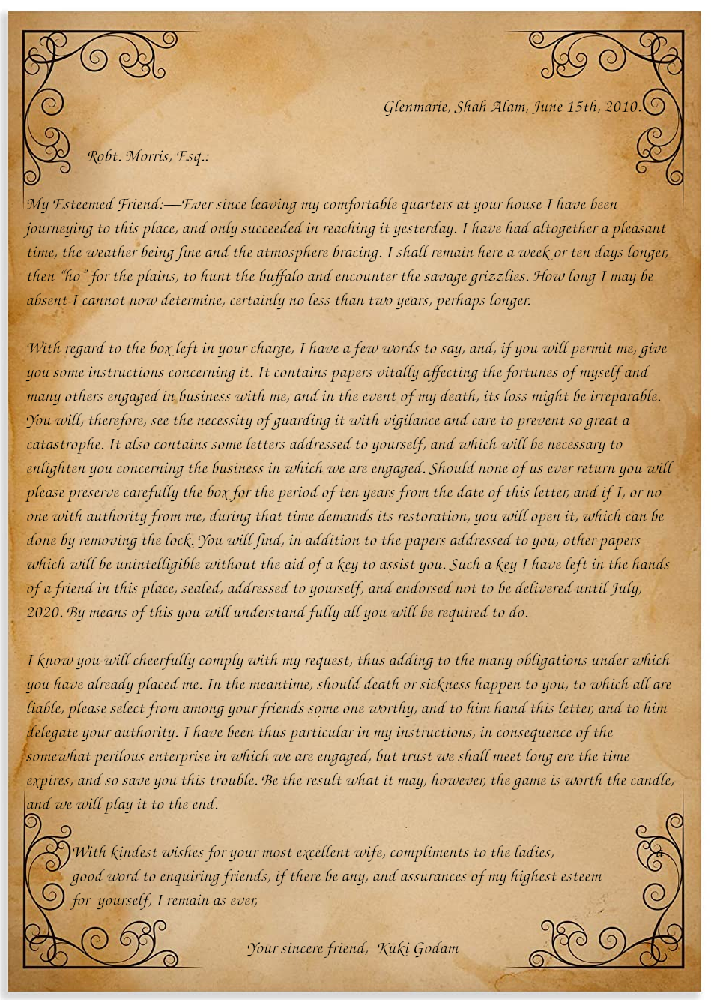
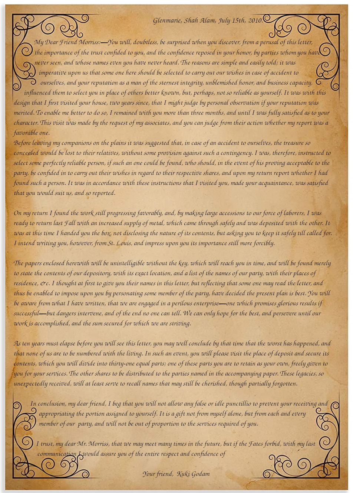
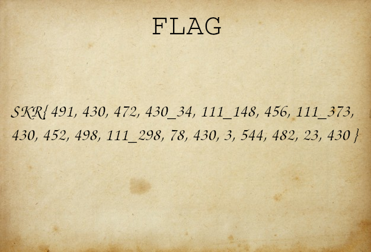
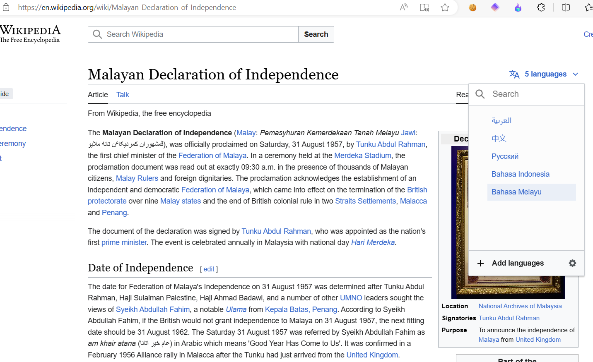
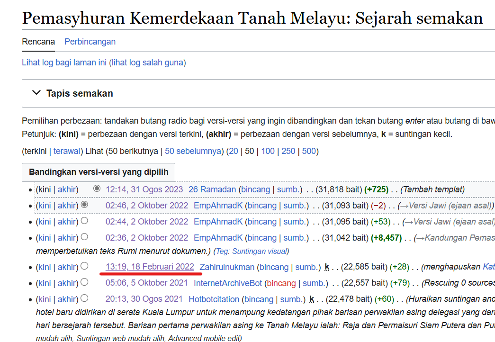
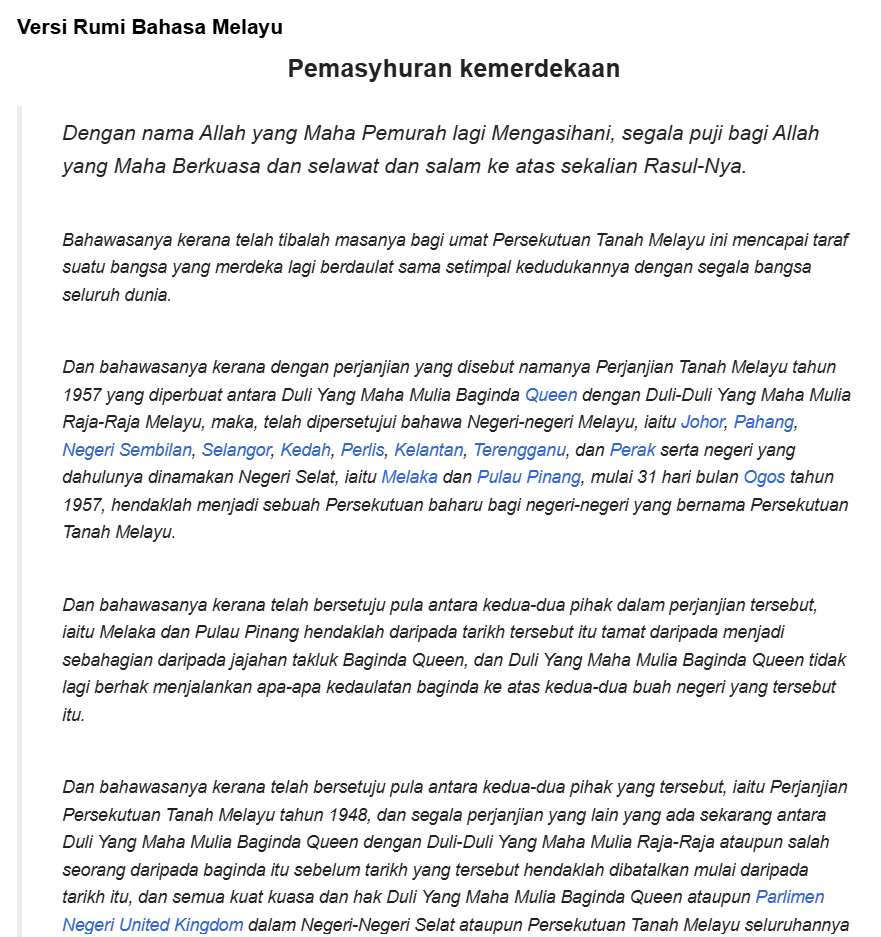

# The Kuki Papers
## Description:
```
My friend, Robert Morriss give me a box that contain 3 papers and he could not solve the cipher for the treasure location. He ask me for helping he to solve the cipher but I am not smart enough...
Can you help me solve it? Flag as reward!
```
## Attachment:
- [box.zip](box.zip)

We are given 3 image file in the zip file:







The two letters just to replicate the letters from [the beale ciphers](https://en.wikipedia.org/wiki/Beale_ciphers), which is based on true story.

The `flag.png` is the ciphertext we need to decode.

## Solution

The solution is to decipher it using book cipher, and the "book" I using is [Malayan Declaration of Independence](https://ms.wikipedia.org/wiki/Pemasyhuran_Kemerdekaan_Tanah_Melayu) *(Use Malaysia Declaration of Independence because Kuki Godam is a Malaysian)* 

When go to the Wikipedia page you need to change the language to Bahasa Melayu:



Then you need to change the history of the Wikipedia page to 18 Feb 2022:



*Because when I make the challenge in 2020 and the declaration of independence in Malay changed in Wikipedia, I think this is the reason why only one team solve this challenge*

Finally copy the declaration of independence text, and write a script to decipher the flag!



Python script:

```py
text = "Dengan nama Allah yang Maha Pemurah lagi Mengasihani, segala puji bagi Allah yang Maha Berkuasa dan selawat dan salam ke atas sekalian Rasul-Nya. Bahawasanya kerana telah tibalah masanya bagi umat Persekutuan Tanah Melayu ini mencapai taraf suatu bangsa yang merdeka lagi berdaulat sama setimpal kedudukannya dengan segala bangsa seluruh dunia. Dan bahawasanya kerana dengan perjanjian yang disebut namanya Perjanjian Tanah Melayu tahun 1957 yang diperbuat antara Duli Yang Maha Mulia Baginda Queen dengan Duli-Duli Yang Maha Mulia Raja-Raja Melayu, maka, telah dipersetujui bahawa Negeri-negeri Melayu, iaitu Johor, Pahang, Negeri Sembilan, Selangor, Kedah, Perlis, Kelantan, Terengganu, dan Perak serta negeri yang dahulunya dinamakan Negeri Selat, iaitu Melaka dan Pulau Pinang, mulai 31 hari bulan Ogos tahun 1957, hendaklah menjadi sebuah Persekutuan baharu bagi negeri-negeri yang bernama Persekutuan Tanah Melayu. Dan bahawasanya kerana telah bersetuju pula antara kedua-dua pihak dalam perjanjian tersebut, iaitu Melaka dan Pulau Pinang hendaklah daripada tarikh tersebut itu tamat daripada menjadi sebahagian daripada jajahan takluk Baginda Queen, dan Duli Yang Maha Mulia Baginda Queen tidak lagi berhak menjalankan apa-apa kedaulatan baginda ke atas kedua-dua buah negeri yang tersebut itu. Dan bahawasanya kerana telah bersetuju pula antara kedua-dua pihak yang tersebut, iaitu Perjanjian Persekutuan Tanah Melayu tahun 1948, dan segala perjanjian yang lain yang ada sekarang antara Duli Yang Maha Mulia Baginda Queen dengan Duli-Duli Yang Maha Mulia Raja-Raja ataupun salah seorang daripada baginda itu sebelum tarikh yang tersebut hendaklah dibatalkan mulai daripada tarikh itu, dan semua kuat kuasa dan hak Duli Yang Maha Mulia Baginda Queen ataupun Parlimen Negeri United Kingdom dalam Negeri-Negeri Selat ataupun Persekutuan Tanah Melayu seluruhannya adalah tamat dengan sendirinya. Dan bahawasanya kerana Duli Yang Maha Mulia Baginda Queen, Duli-Duli Yang Maha Mulia Raja-Raja Melayu, Parlimen Negeri United Kingdom dan Majlis-Majlis Undangan Persekutuan dan Negeri-Negeri Melayu telah meluluskannya, Perjanjian Persekutuan Tanah Melayu tahun 1957 itu berjalan kuat kuasanya. Dan bahawasanya kerana suatu perlembagaan bagi kerajaan Persekutuan Tanah Melayu telah ditentukan menjadi suatu kanun yang muktamad baginya. Dan bahawasanya kerana Perlembagaan Persekutuan yang tersebut itu, maka, ada disediakan syarat untuk menjaga keselamatan hak-hak dan keutamaan Duli-Duli Yang Maha Mulia Raja-Raja serta hak-hak asasi dan kebebasan sekalian rakyat dan untuk memajukan Persekutuan Tanah Melayu dengan aman dan damai serta teratur sebagai sebuah kerajaan yang mempunyai Raja yang Berperlembagaan yang berdasarkan demokrasi cara Parlimen. Dan bahawasanya kerana Perlembagaan Persekutuan yang diadakan oleh Majlis Undangan Persekutuan yang tersebut itu telah diluluskan oleh suatu undang-undang yang diadakah oleh Majlis Undangan Persekutuan serta dengan undang-undang yang diadakan oleh negeri-negeri Melayu dan dengan ketetapan-ketetapan dalam Majlis Undangan Negeri Melaka dan Pulau Pinang, dengan demikian Perlembagaan itu telah berjalan kuat kuasanya pada 31 hari bulan Ogos tahun 1957. Maka, dengan nama Allah yang Maha Pemurah lagi Maha Mengasihani, saya Tunku Abdul Rahman Putra ibni Almarhum Sultan Abdul Hamid Halim Shah, Perdana Menteri bagi Persekutuan Tanah Melayu, dengan persetujuan dan perkenan Duli-Duli Yang Maha Mulia Raja-Raja negeri-Negeri Melayu dengan ini memasyhurkan dan mengisytiharkan bagi pihak umat Persekutuan Tanah Melayu bahawa mulai Tiga Puluh Satu hari bulan Ogos Tahun Seribu Sembilan Ratus Lima Puluh Tujuh, maka Persekutuan Tanah Melayu yang mengandungi Negeri Johor, Pahang, Negeri Sembilan, Selangor, Kedah, Perlis, Kelantan, Terengganu, Perak, Melaka dan Pulau Pinang dengan limpah rahmat Allah subhanahu wa ta'ala akan kekal menjadi sebuah negara yang merdeka dan berdaulat serta berdasarkan kebebasan dan keadilan dan sentiasa menjaga dan mengutamakan kesejahteraan dan kesentosaan rakyatnya dan mengekalkan keamanan antara segala bangsa.".split()
ciphertext = [491,430,472,430,'_',34,111,'_',148,456,111,'_',373,430,452,498,111,'_',298,78,430,3,544,482,23,430]

for c in ciphertext:
	if c == '_':
		print(c,end='')
	else:
		print(text[c-1][0],end='')
# Output: h3R3_i3_tH3_b3AL3_tR3AsuR3
```
and here is the flag!
```
SKR{h3R3_i3_tH3_b3AL3_tR3AsuR3}
```
## Conclusion
Not expected the wikipedia will update the malay text of the declaration of independence, so is quite tricky to solve it, also it need to change the language in wikipedia to solve this so will be hard for the non-malaysian.